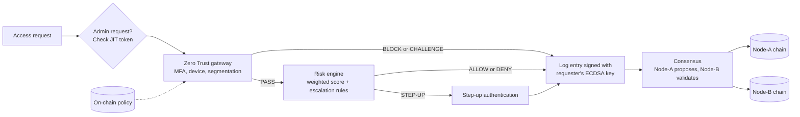

# B-ZTA: Blockchain-Enhanced Zero Trust Architecture

A Python simulation of Zero Trust access control for government digital services, where every access decision is written to an ECDSA-signed, tamper-evident blockchain audit log replicated across two nodes. Built as the prototype for my Master of Applied Technologies thesis at Unitec Institute of Technology, using Bangladesh government agencies as the case study.

All users, IP addresses and records are synthetic.

## What it demonstrates

| Area | Feature |
|---|---|
| Zero Trust gateway | MFA, device posture and agency segmentation checked on every request, following NIST SP 800-207 principles. Soft MFA is refused from high-risk locations. |
| Risk engine | Ten weighted factors produce a 0–10 score. Behavioural signals (semantic velocity, reputation EMA) plus escalation rules force step-up authentication for severe indicators. |
| Privileged access | Just-in-time (JIT) tokens tied to one user and resource, valid for 5 minutes. No standing admin privilege. |
| Session continuity | Trust decays over a session, forcing re-authentication after about 85 minutes. |
| Audit layer | Each log entry is signed with the requester's ECDSA key, validated by a replica node and stored independently on both nodes. Tampering and forged records are detected. |
| Policy integrity | The segmentation policy itself lives on-chain; changes need consensus and are applied only after commit. |
| Completeness | Signed heartbeat blocks act as anchors, so a suppressed logging monitor is detectable. |

Tags such as `[B1]` or `[C3]` in the code link each feature to a recommendation from the thesis expert interviews, and code comments quote the interview questions that motivated them.

## Architecture



## Threat scenarios and results

Results from the included run, read from the untampered replica (Node-B):

| Scenario | Outcome |
|---|---|
| Normal operations (6 legitimate users) | 6/6 allowed |
| Persona 1: external attacker, no credentials | 4/4 blocked at the gateway |
| Persona 2: malicious insider with valid credentials | First 5 requests allowed. The 6th (a sweep of 6 resources in a minute) and 7th (an 18 MB export at 2 a.m.) forced step-up, which failed, so both were denied |
| Persona 3: privileged admin with a JIT token | Allowed; the same token is rejected for a different user |
| Persona 4: stolen password and TOTP from a foreign IP | 2/2 blocked at MFA (hardware key required from high-risk locations) |
| Session aged 90 minutes | Trust fell from 0.92 to 0.69, below the 0.70 threshold, so the gateway re-challenged it |
| Attacker edits 4 records on Node-A | 4/4 detected; Node-B stayed valid and a cross-node comparison pinpointed the altered blocks |
| Insider forges an "ALLOW" record with the wrong key | Rejected by the replica: invalid signature |
| Audit chain | 27/28 blocks carry a valid ECDSA signature (the genesis block is unsigned); 3 heartbeat anchors, no gaps |

The notebook ends with **14 self-checks** that assert these claims, so any change that breaks one fails loudly.

## How to run

Tested with Python 3.12; should work on Python 3.9 or later.

```bash
git clone https://github.com/syedaraf/Blockchain-Enhanced-Zero-Trust-Architecture-.git
cd Blockchain-Enhanced-Zero-Trust-Architecture-
pip install -r requirements.txt
jupyter notebook B-ZTA.ipynb
```

Then run all cells in order. To use Google Colab instead, open the notebook from GitHub in Colab and run `!pip install cryptography` first if the import fails. Set `USE_COLOR = True` in the first code cell for coloured terminal output.

## Limitations

This is a research simulation, not production software.

- **Two-node consensus tolerates no malicious node.** Real PBFT needs at least 3f+1 nodes to tolerate f faulty ones, e.g. four nodes to tolerate one. The simulation shows the message flow and replica-side validation.
- **Segmentation checks the agency a user acts under, not which agency owns each resource.** That is why the insider's first five requests, some touching other ministries' databases, were allowed until behavioural scoring caught the pattern.
- **Heartbeats are count-based.** They reveal a suppressed heartbeat monitor, but detecting logging switched off for a period of time needs time-based heartbeats.
- **Risk weights, thresholds and decay parameters are illustrative** and have not been calibrated against real access logs.
- **The JIT approval workflow is simplified.** In the demo the admin approves their own request, so there is no separation of duties.
- Keys are held in memory (production would use an HSM or smart cards), the small proof-of-work step is illustrative only, and post-quantum signatures (ML-DSA / CRYSTALS-Dilithium, NIST FIPS 204) are documented as a future path but not implemented.

## Future work

- Byzantine fault-tolerant consensus with four or more nodes, for example on a permissioned platform such as Hyperledger Fabric
- Time-based heartbeat anchors
- Resource-ownership checks in the segmentation policy
- Post-quantum signatures and HSM-backed key storage
- Calibrating the risk model with real or realistic access logs

## Changes since the thesis version (v4.0 → v4.1)

- **Independent node copies:** both nodes previously shared the same block objects, so tampering with Node-A also changed Node-B, and the "Node-B valid" message was printed rather than computed. Each node now stores its own copy, and a cross-node comparison was added.
- **Trust decay:** coefficient raised from 0.10 to 0.25. Previously a 0.92 session never fell below 0.81 within two hours, so re-authentication was never triggered.
- **Insider detection:** mass exfiltration and semantic velocity now force step-up. In v4.0 the insider's weighted score never reached HIGH, so all seven insider requests were allowed.
- **Heartbeat detection** rewritten to remove false alarms; heartbeats are now signed, and the signed-block count verifies signatures instead of checking the field is non-empty.
- **JIT enforcement:** admin requests without a token are now challenged (previously a missing token skipped the check).
- **Policy updates** are applied only after consensus commit.
- **Summary figures** are computed from access requests only, and the stolen-credential scenario description was corrected (blocked at MFA, not via step-up).
- Notebook split into documented sections, self-checks added, colour output made optional.

## Author

Syed Araf Hossain, Master of Applied Technologies, Unitec Institute of Technology, Auckland.
